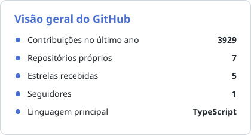
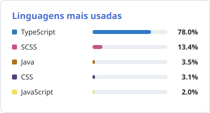

# Glaucco Siqueira

**Engenheiro de Software Sênior · Full-stack · Brasília/DF 🇧🇷 · remoto para os EUA 🇺🇸**

Atuo em um **laboratório norte-americano de pesquisa de IA (Y Combinator)**, construindo benchmarks para avaliação de agentes de IA e aplicações full-stack de produção — trabalho 100% em inglês. Construo produtos de ponta a ponta: APIs com **Go, Node.js e Django**, frontends com **React, Next.js, Angular e Vue**, com testes automatizados como padrão de projeto, não como etapa opcional.

  
  

## Sobre

- Hoje: **treinamento e avaliação de agentes de IA** — projeto benchmarks estilo SWE-bench (ambiente Docker reproduzível, suíte de testes e solução de referência) e caço e corrijo bugs em bases **C/C++, Go e Python** com dezenas de milhares de linhas.
- Base forte em **JavaScript/TypeScript**, transitando com naturalidade entre **Go, Python, Java e C/C++** — escolho a ferramenta pelo problema, não pelo hype.
- Qualidade como fluxo padrão: **testes automatizados (Jest, Vitest, Cypress, Playwright), CI/CD e code review** em todo projeto.
- **PostgreSQL, Docker e Linux** no dia a dia; prefiro arquiteturas que envelhecem bem — código legível, bem tipado e coberto por testes.
- Fora do teclado, musculação: a mesma disciplina de progressão constante do treino, aplicada à engenharia.

> 🔒 Boa parte do meu trabalho recente (benchmarks de IA e sistemas em C/C++ e Go) vive em **repositórios privados** — o gráfico de contribuições no fim da página conta essa atividade.

## Experiência

- **AfterQuery** — laboratório de pesquisa de IA (EUA, Y Combinator) · *Engenheiro de Software Sênior* · abr 2026 – atual
  Benchmarks para avaliação de agentes de IA, aplicações full-stack de produção (Go, TypeScript, Angular, React, PostgreSQL) e correção de bugs em C/C++ — remoto, 100% em inglês.
- **Mate Academy** — *Desenvolvedor Full Stack* · ago 2025 – abr 2026
  Autenticação OAuth multi-provider (Google, GitHub, Apple), chat em tempo real com Socket.IO e e-commerce SPA com Redux Toolkit.
- **CI&T** — *Desenvolvedor Front-end* · jan – jul 2025
  Interfaces SSR com Next.js, React e TypeScript; mais de 15 componentes reutilizáveis que aceleraram o desenvolvimento de novas telas em ~35%.

## Projetos em destaque

### [Sistema de Reembolso](https://github.com/glauccoeng-prog/sistema_de_reembolso) · [🔗 demo ao vivo](https://sistema-de-reembolso-two.vercel.app/)

Aplicação web completa para gestão de reembolsos corporativos: CRUD, busca com debounce, upload de comprovantes com drag-and-drop e PWA instalável. **52 testes automatizados**, CI/CD com GitHub Actions e deploy na Vercel.

`TypeScript` `React` `Vite` `TanStack Query` `Vitest` `Testing Library` `GitHub Actions`

### [CodeLeap Network](https://github.com/glauccoeng-prog/CodeLeap)

Rede social estilo Twitter/Instagram com **interações em tempo real** via Cloud Firestore: autenticação com Firebase, likes, reposts, comentários com @menções, notificações e scroll infinito.

`TypeScript` `Next.js` `React` `Firebase` `Tailwind CSS` `TanStack Query`

### [Catálogo de Produtos — React](https://github.com/glauccoeng-prog/react_phone-catalog) · [🔗 demo ao vivo](https://glauccoeng-prog.github.io/react_phone-catalog/)

Catálogo de produtos estilo e-commerce com **carrinho de compras, favoritos e slider de imagens**, navegação SPA com React Router e estilização com SCSS Modules — **publicado no GitHub Pages**.

`React` `TypeScript` `React Router` `SCSS` `Vite`

### [Gestão de Usuários — Desafio Attus](https://github.com/glauccoeng-prog/desafio-attus-angular)

CRUD com Angular moderno: Standalone Components, estado reativo com Signals e validação de CPF e telefone com máscaras automáticas. **91 testes unitários**, TypeScript em modo estrito e ESLint + Prettier com Husky pre-commit.

`Angular` `TypeScript` `RxJS` `Signals` `Vitest`

### [HTML Analyzer — Desafio Axur](https://github.com/glauccoeng-prog/desafio_axur)

Analisador de HTML em **Java 17 puro, sem bibliotecas externas**: parsing próprio com estrutura de pilha para encontrar o texto no nível mais profundo do documento, com detecção de HTML malformado (bônus do desafio) e testes unitários.

`Java` `JDK 17`

## Stack

<table>
  <tr>
    <td><strong>Linguagens</strong></td>
    <td></td>
  </tr>
  <tr>
    <td><strong>Frontend</strong></td>
    <td></td>
  </tr>
  <tr>
    <td><strong>Backend &amp; Dados</strong></td>
    <td></td>
  </tr>
  <tr>
    <td><strong>Testes</strong></td>
    <td></td>
  </tr>
  <tr>
    <td><strong>Ferramentas</strong></td>
    <td></td>
  </tr>
</table>

Também no dia a dia:

## Atividade

  <picture>
    <source media="(prefers-color-scheme: dark)" srcset="assets/stats-dark.svg">
    
  </picture>
  <picture>
    <source media="(prefers-color-scheme: dark)" srcset="assets/langs-dark.svg">
    
  </picture>

📊 Cards gerados diariamente por [GitHub Actions deste repositório](.github/workflows/stats.yml) — sem depender de serviços externos.

## Vamos conversar?

Aberto a conversas sobre oportunidades e projetos — o caminho mais rápido é o LinkedIn.

  
  

---

<picture>
  <source media="(prefers-color-scheme: dark)" srcset="https://raw.githubusercontent.com/glauccoeng-prog/glauccoeng-prog/output/github-snake-dark.svg">
  <source media="(prefers-color-scheme: light)" srcset="https://raw.githubusercontent.com/glauccoeng-prog/glauccoeng-prog/output/github-snake.svg">
  
</picture>

