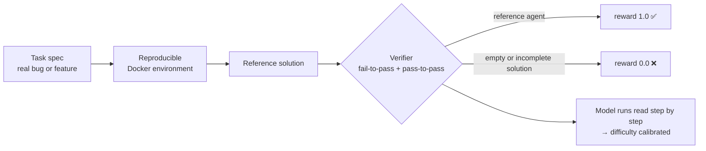
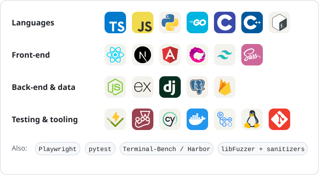
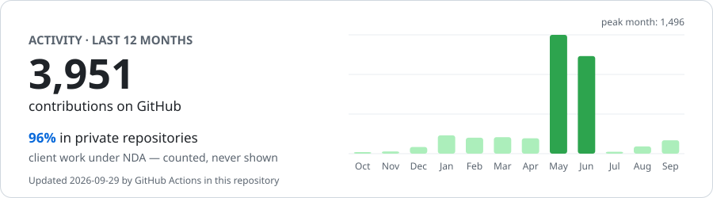

<picture>
  <source media="(prefers-color-scheme: dark)" srcset="assets/header-dark.svg">
  
</picture>

🇧🇷 *Engenheiro de software · [versão em português no fim da página](#pt)*

I write the tests that show whether an AI coding agent can actually program. The clients are US AI labs. Each task is a real programming problem in a Docker container, plus my reference solution and a verifier that grades the agent. The verifier takes most of my time. It has to be strict, and it has to be fair. I started out building full-stack web apps with TypeScript, React, Angular, Node.js and Python, and I still take that kind of work.

  
  

## How I evaluate coding agents

```mermaid
flowchart LR
  A["Task spec<br/>real bug or feature"] --> B["Reproducible<br/>Docker environment"]
  B --> C["Reference solution"]
  C --> D{"Verifier<br/>fail-to-pass + pass-to-pass"}
  D -->|"reference agent"| E["reward 1.0 ✅"]
  D -->|"empty or incomplete solution"| F["reward 0.0 ❌"]
  D --> G["Model runs read step by step<br/>→ difficulty calibrated"]
```

My rule for a task: the reference solution passes, and an empty or incomplete solution fails. If either half doesn't hold, the task isn't done.

- At AfterQuery, a Y Combinator-backed AI data lab, I've had more than 25 tasks approved. I write them in Go, Python and C/C++, and they go from SWE-bench-style bug fixes to memory-safety work with fuzzing and web-app repairs I check in a real browser.
- I also work for US AI data companies whose names I can't share, on tasks in the open [Terminal-Bench / Harbor](https://github.com/harbor-framework/harbor) format. A few of mine are in Brazilian Portuguese, which is my first language. The agent gets files in Portuguese, with Brazilian numbers, dates and documents, and has to handle them correctly.

## Featured work

| Project | What it shows | Links |
|---|---|---|
| **Agent eval playground** | Synthetic benchmark tasks in the Harbor format, with CI proving that the reference solution scores 1.0 and the empty agent 0.0 | [code](https://github.com/glauccoeng-prog/agent-eval-playground) |
| **Angular 21 user manager** | Take-home challenge from a hiring process: Signals, RxJS, Angular Material, **91 tests (90.5% coverage)**, CI | [code](https://github.com/glauccoeng-prog/desafio-attus-angular) · [live](https://glauccoeng-prog.github.io/desafio-attus-angular/) |
| **Expense reimbursement PWA** | React 19 + TypeScript + TanStack Query, installable PWA, **52 tests**, CI/CD | [code](https://github.com/glauccoeng-prog/sistema_de_reembolso) · [live](https://sistema-de-reembolso-two.vercel.app/) |
| **CodeLeap Network** | Take-home challenge: Next.js + Firebase social feed with real-time updates, @mentions and infinite scroll | [code](https://github.com/glauccoeng-prog/CodeLeap) · [live](https://code-leap-phi.vercel.app/) |
| **Nice Gadgets store** | React + TypeScript e-commerce catalog with cart, favorites and URL-synced search (bootcamp final project) | [code](https://github.com/glauccoeng-prog/react_phone-catalog) · [live](https://glauccoeng-prog.github.io/react_phone-catalog/) |
| **HTML analyzer** | Take-home challenge: plain Java 17 parser, no libraries, stack-based, detects malformed HTML | [code](https://github.com/glauccoeng-prog/desafio_axur) |

## Stack

<picture>
  <source media="(prefers-color-scheme: dark)" srcset="assets/stack-dark.svg">
  
</picture>

## Activity

<picture>
  <source media="(prefers-color-scheme: dark)" srcset="assets/activity-dark.svg">
  
</picture>

Most of my recent work lives in private client repositories, so the chart counts it without showing any of it.

<b>Experience and education</b>

 

| Role | Where | When |
|---|---|---|
| AI Benchmark Engineer (contract) | AfterQuery | Apr 2026 – present |
| AI Benchmark Engineer (contract) | US AI data companies (confidential) | Sep 2026 – present |
| Full Stack Development Intern | CI&T (NYSE: CINT) | Jan 2025 – Jul 2025 |
| Automation Developer (freelance) | Mengoni Engenharia & Arquitetura | Jan 2024 – Aug 2024 |
| Full Stack Developer (freelance) | Own and client projects | Oct 2022 – Dec 2024 |

- **Postgraduate certificate in Full Stack Development**: Faculdade Impacta, 2026 (360 h, GPA 9.91/10)
- **B.S. in Software Engineering**: Centro Universitário Ampli, 2025
- **Certificates**: Full-stack & Front-end Developer (Mate Academy, 2026) · Full Stack Python Developer (EBAC, 2024)
- **Languages**: Portuguese (native) · English (professional, used daily with US teams)

<b>🇧🇷 Em português</b>

 

Sou engenheiro de software. Hoje escrevo os testes que mostram se um agente de IA de programação sabe mesmo programar, principalmente para laboratórios de IA dos Estados Unidos. Cada tarefa é um problema real de programação num contêiner Docker, com a minha solução de referência e um verificador que dá a nota ao agente. É no verificador que vai a maior parte do meu tempo: ele precisa ser rigoroso e justo.

- Na **AfterQuery**, laboratório de dados de IA apoiado pela Y Combinator, tenho mais de 25 tarefas aprovadas, em Go, Python e C/C++.
- Também trabalho para **empresas de dados de IA dos EUA** (nomes em sigilo por contrato), com tarefas no formato aberto Terminal-Bench/Harbor. Algumas são em português do Brasil, minha língua nativa: o agente recebe arquivos em português, com números, datas e documentos no padrão brasileiro.
- Tenho base full stack em TypeScript, React, Angular, Node.js, Python/Django e PostgreSQL, com testes automatizados e CI/CD.
- Sou bacharel em Engenharia de Software e pós-graduado em Full Stack Development.
- Estou aberto a vagas CLT no Brasil e a trabalho remoto para empresas dos EUA.

O caminho mais rápido para conversar é o [LinkedIn](https://www.linkedin.com/in/glaucco-siqueira/).

Every image on this page is generated and hosted in this repository (see [`scripts/`](scripts) and [`.github/workflows/`](.github/workflows)). No external image service is used.
