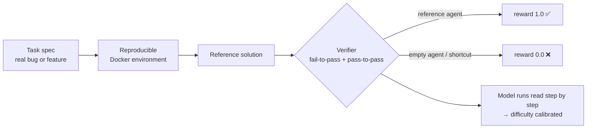

<picture>
  <source media="(prefers-color-scheme: dark)" srcset="assets/header-dark.svg">
  
</picture>

🇧🇷 *Engenheiro de software em Brasília · [versão em português no fim da página](#pt)*

I build the tests that tell whether an AI coding agent can really program. For US AI labs, I write benchmark tasks: a real programming problem inside a Docker container, a reference solution, and an automated verifier that grades the agent and is hard to game. Before that, and still today, I ship full-stack web apps with TypeScript, React, Angular, Node.js and Python.

  
  

## How I evaluate coding agents

```mermaid
flowchart LR
  A["Task spec<br/>real bug or feature"] --> B["Reproducible<br/>Docker environment"]
  B --> C["Reference solution"]
  C --> D{"Verifier<br/>fail-to-pass + pass-to-pass"}
  D -->|"reference agent"| E["reward 1.0 ✅"]
  D -->|"empty agent / shortcut"| F["reward 0.0 ❌"]
  D --> G["Model runs read step by step<br/>→ difficulty calibrated"]
```

A task is only valid when the reference solution passes **and** an agent that does nothing, or cheats, fails.

- **AfterQuery** (Y Combinator-backed AI data lab): tasks in Go, Python and C/C++, including SWE-bench-style bug fixes, fuzzing-driven memory-safety tasks and browser-tested web repairs. More than 25 approved so far.
- **A US AI data company** (name confidential by contract): evaluation tasks in the open [Terminal-Bench / Harbor](https://github.com/harbor-framework/harbor) format, with verifiers hardened against reward hacking.

## Featured work

| Project | What it shows | Links |
|---|---|---|
| **Agent eval playground** | Synthetic benchmark tasks in the Harbor format, with CI proving that the reference solution scores 1.0 and the empty agent 0.0 | [code](https://github.com/glauccoeng-prog/agent-eval-playground) |
| **Angular 21 user manager** | Take-home challenge from a hiring process: Signals, RxJS, Angular Material, **91 tests (90.5% coverage)**, CI | [code](https://github.com/glauccoeng-prog/desafio-attus-angular) · [live](https://glauccoeng-prog.github.io/desafio-attus-angular/) |
| **Expense reimbursement PWA** | React 19 + TypeScript + TanStack Query, installable PWA, **52 tests**, CI/CD | [code](https://github.com/glauccoeng-prog/sistema_de_reembolso) · [live](https://sistema-de-reembolso-two.vercel.app/) |
| **CodeLeap Network** | Take-home challenge: Next.js + Firebase social feed with real-time updates, @mentions and infinite scroll | [code](https://github.com/glauccoeng-prog/CodeLeap) · [live](https://code-leap-phi.vercel.app/) |
| **Nice Gadgets store** | React + TypeScript e-commerce catalog with cart, favorites and URL-synced search (bootcamp final project) | [code](https://github.com/glauccoeng-prog/react_phone-catalog) · [live](https://glauccoeng-prog.github.io/react_phone-catalog/) |
| **HTML analyzer** | Take-home challenge: plain Java 17 parser, no libraries, stack-based, detects malformed HTML | [code](https://github.com/glauccoeng-prog/desafio_axur) |

## Stack

<picture>
  <source media="(prefers-color-scheme: dark)" srcset="assets/stack-dark.svg">
  
</picture>

## Activity

<picture>
  <source media="(prefers-color-scheme: dark)" srcset="assets/activity-dark.svg">
  
</picture>

Most of my recent work lives in private client repositories, so the chart counts it without showing any of it.

<b>Experience and education</b>

 

| Role | Where | When |
|---|---|---|
| AI Benchmark Engineer (contract) | AfterQuery | Apr 2026 – present |
| AI Benchmark Engineer (contract) | US AI data company (confidential) | Sep 2026 – present |
| Full Stack Development Intern | CI&T (NYSE: CINT) | Jan 2025 – Jul 2025 |
| Automation Developer (freelance) | Mengoni Engenharia & Arquitetura | Jan 2024 – Aug 2024 |
| Full Stack Developer (freelance) | Own and client projects | Oct 2022 – Dec 2024 |

- **Postgraduate certificate in Full Stack Development**: Faculdade Impacta, 2026 (360 h, GPA 9.91/10)
- **B.S. in Software Engineering**: Centro Universitário Ampli, 2025
- **Certificates**: Full-stack & Front-end Developer (Mate Academy, 2026) · Full Stack Python Developer (EBAC, 2024)
- **Languages**: Portuguese (native) · English (professional, used daily with US teams)

<b>🇧🇷 Em português</b>

 

Sou engenheiro de software em Brasília. Hoje crio as tarefas que medem se um agente de IA sabe mesmo programar. Para laboratórios de IA dos Estados Unidos, escrevo tarefas de benchmark: um problema real de programação dentro de um contêiner Docker, uma solução de referência e um verificador automático que dá a nota e é difícil de enganar.

- Na **AfterQuery**, crio tarefas em Go, Python e C/C++. Mais de 25 foram aprovadas até agora.
- Para uma **empresa de IA dos EUA** (nome em sigilo por contrato), crio avaliações no formato aberto Terminal-Bench/Harbor.
- Tenho base full stack em TypeScript, React, Angular, Node.js, Python/Django e PostgreSQL, com testes automatizados e CI/CD.
- Sou bacharel em Engenharia de Software e pós-graduado em Full Stack Development.
- Estou aberto a vagas CLT no Brasil e a trabalho remoto para empresas dos EUA.

O caminho mais rápido para conversar é o [LinkedIn](https://www.linkedin.com/in/glaucco-siqueira/).

Every image on this page is generated and hosted in this repository (see [`scripts/`](scripts) and [`.github/workflows/`](.github/workflows)). No external image service is used.
